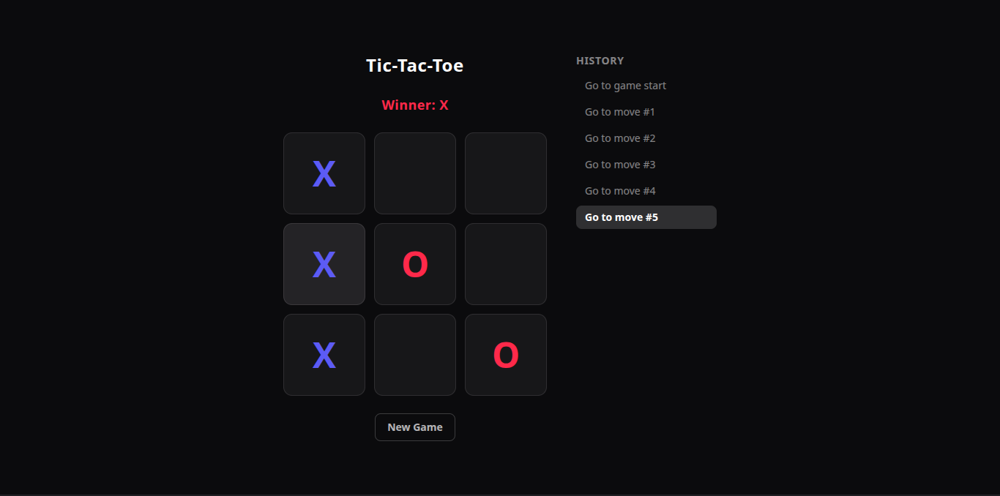

# Tic-Tac-Toe

An interactive Tic-Tac-Toe game built with React and TypeScript, based on the [official React tutorial](https://react.dev/learn/tutorial-tic-tac-toe) — extended with custom dark-theme styling, move history, and a reset feature.

## Overview

A classic Tic-Tac-Toe game where two players take turns marking X and O on a 3x3 grid. The game detects a winner automatically, keeps a full history of moves, and lets players jump back to any previous state of the board.

## Preview



## Live Demo

[View live site](https://tic-tac-toe-game-sable-gamma.vercel.app/)

## Features

- Players alternate turns automatically (X always goes first)
- Automatic winner detection across all rows, columns, and diagonals
- Clicking a filled square or playing after a win is blocked
- Full move history with the ability to jump back to any previous move
- "New Game" button to reset the board
- Dark theme with bold, high-contrast styling for X and O
- Built with strict TypeScript typing throughout

## Tech Stack

- [React](https://react.dev/)
- [TypeScript](https://www.typescriptlang.org/)
- [Tailwind CSS](https://tailwindcss.com/)
- [Vite](https://vitejs.dev/)

## Project Structure

```
src/
├── App.tsx     # Square, Board, and Game components, game logic, and styling
├── index.css   # Tailwind import and global styles
├── main.tsx    # App entry point
```

## What I Learned

This project was built by following and extending the official React tutorial, which helped reinforce:

- Managing state with `useState` across multiple components
- Lifting state up from a child component (`Board`) to a parent (`Game`)
- Passing data and behavior down via props (`squares`, `xIsNext`, `onPlay`)
- Updating arrays immutably with `slice()` and the spread operator
- Deriving values from state instead of storing redundant state (e.g. `xIsNext` from `currentMove`)
- Writing a pure function (`calculateWinner`) to keep game logic separate from UI
- Adding TypeScript types to component props and function parameters
- Styling with Tailwind CSS to build a custom visual theme
